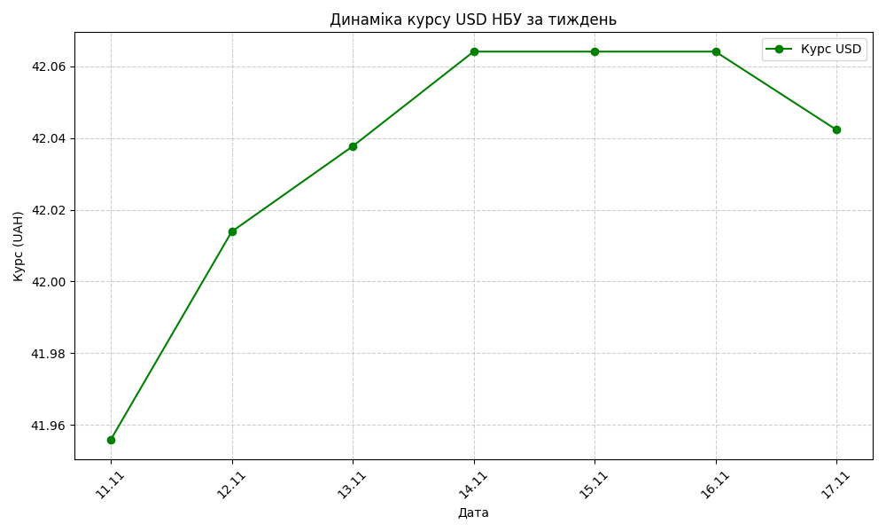
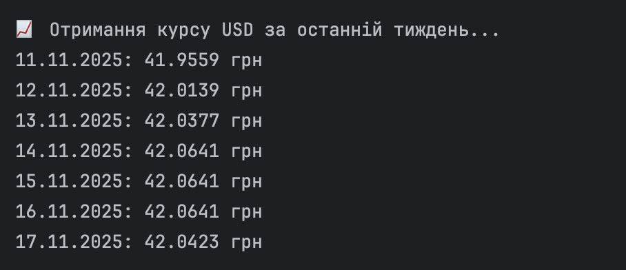
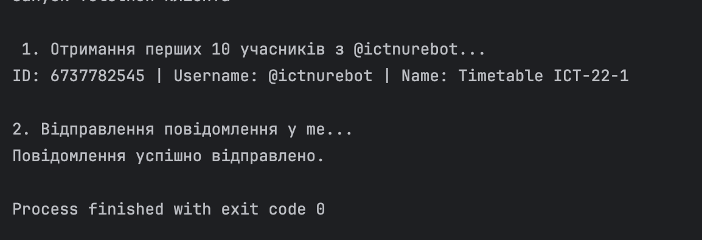
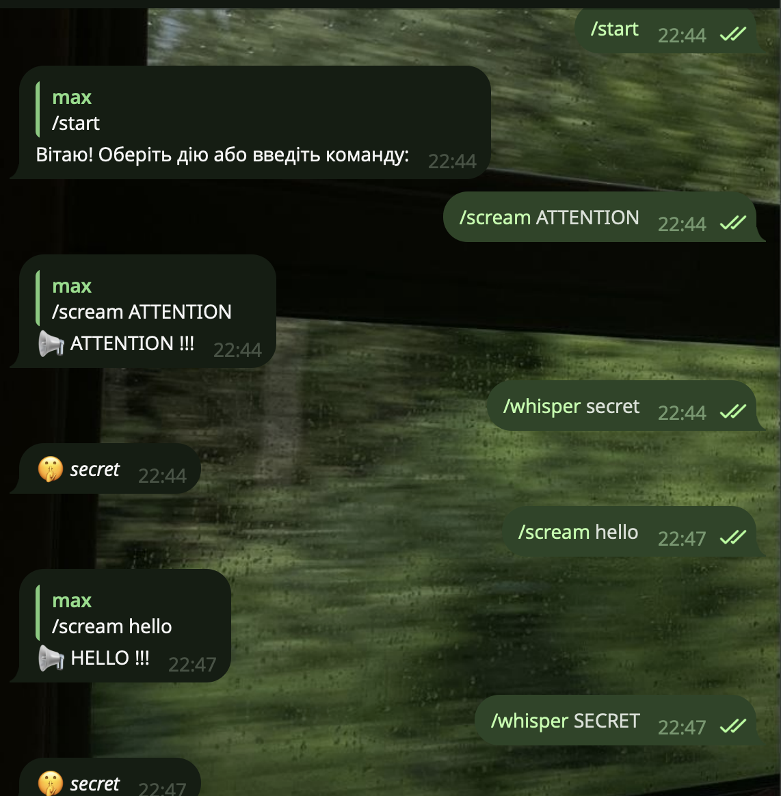

# Лабораторна робота №1: Мережне програмування

## Мета роботи
Ознайомлення з принципами роботи протоколу HTTP, виконання запитів до публічних API, отримання та обробка даних у форматі JSON, побудова графіків за отриманими даними, робота з Telegram API через бібліотеки Telethon та Bot API.

## Хід роботи

### Завдання 1. Отримати курс валют НБУ за допомогою Postman
Створено GET-запит до API НБУ (`/NBU_Exchange/exchange_site`) через Postman. Дані за попередній тиждень успішно отримані та перевірені.

  

<b>Рисунок 1 - Успішний запит Postman</b>

---

### Завдання 2. Отримати курс валют НБУ за допомогою Python
Скрипт `nbu_currency_tasks.py` використовує бібліотеку `requests` для отримання даних НБУ за тиждень. Дані виводяться у консоль та обробляються для побудови графіка.

  

<b>Рисунок 2 - Графік динаміки курсу USD</b>

  

<b>Рисунок 3 - Отримання курсу USD </b>

---

### Завдання 3. Використання Telethon для Telegram
Скрипт `telethon_tasks.py` отримує перелік користувачів чату та відправляє повідомлення конкретному контакту або у збережені повідомлення.

  

<b>Рисунок 4 - Список користувачів та відправлене повідомлення</b>

---

### Завдання 4. Створення Telegram бота
Створено Telegram бота (`telegram_bot.py`) з підтримкою команд:
- `/menu` - виводить клавіатуру з підказками  
- `/scream` - повертає введений текст у ВЕРХНЬОМУ РЕГІСТРІ  
- `/whisper` - повертає текст у нижньому регістрі курсивом  

  

<b>Рисунок 4 - Демонстрація роботи команд бота</b>

---

## Висновки
Під час виконання лабораторної роботи ми ознайомилися з принципами роботи протоколу HTTP та отриманням даних через публічні API, навчились використовувати бібліотеки `requests` та `matplotlib` для збору та візуалізації даних, освоїли взаємодію з Telegram через `Telethon` і Bot API. Робота дозволила закріпити практичні навички побудови запитів, обробки JSON-даних та створення простих ботів для автоматизації задач, що є важливим етапом у розвитку навичок мережного програмування та програмування на Python.
