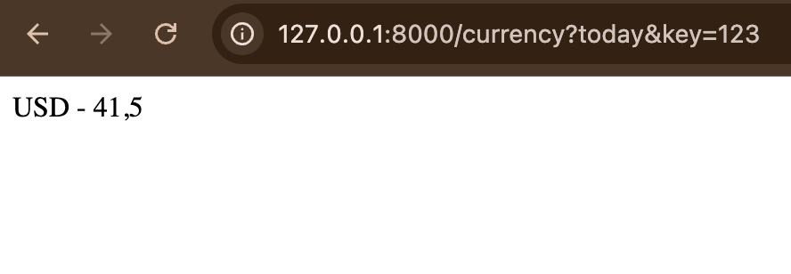
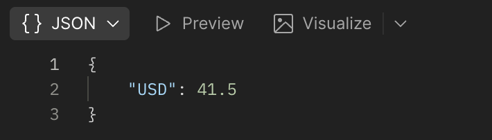
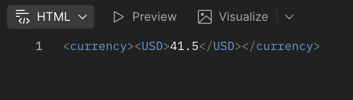
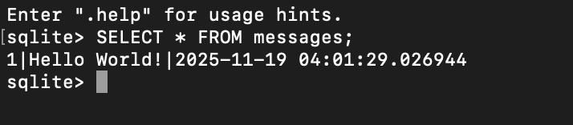

# Лабораторна робота №2: Робота з HTTP протоколом, запитами та публічними API

## Мета роботи
Ознайомлення з принципами роботи HTTP-протоколу, обробкою GET та POST-запитів сервером на Python, використанням параметрів у URL, заголовків запиту, збереженням даних у файли та бази даних SQLite.

## Хід роботи

### Завдання 1. Запуск веб-сервера на Flask
Створено простий веб-сервер `server.py` на Flask, який слухає порт 8000 та повертає тестову сторінку.

  

<b>Рисунок 1 - Запуск сервера</b>

---

### Завдання 2. Обробка GET-запиту з параметрами
Скрипт `getparam.py` обробляє GET-запит за URL `/currency?today&key=value` і повертає статичне значення курсу USD.

  

<b>Рисунок 2 - Отримання параметрів GET-запиту</b>

---

### Завдання 3. Обробка GET-запиту з вибором формату відповіді
Скрипт `headers.py` читає заголовок `Content-Type` запиту і повертає дані у форматі JSON, XML або простим текстом, залежно від значення заголовка.

  

  

<b>Рисунок 3-4 - Обробка заголовків Content-Type</b>

---

### Завдання 4. GET-запит з динамічним курсом валют
Скрипт `getcurrency.py` обробляє GET-запит `/currency?param=<значення>` з параметрами `today` та `yesterday`, отримує актуальний курс USD з API НБУ та повертає його у відповіді.

  

  

<b>Рисунок 5-6 - Динамічний курс валют</b>

---

### Завдання 5. Збереження POST-запиту у файл
Скрипт `easypost.py` отримує POST-запит з текстом та зберігає його у файл `data.txt`.

  

<b>Рисунок 7 - Збереження даних у файл</b>

---

### Завдання 6. Збереження POST-запиту у базу даних SQLite
Скрипт `savetodb.py` отримує POST-запит з текстом та зберігає дані у базу `data.db` у таблицю `messages` з полями `id`, `text` та `created`.

  

<b>Рисунок 8 - Збереження даних у SQLite</b>

---

## Висновки
Під час виконання лабораторної роботи ми ознайомилися з принципами роботи HTTP-протоколу та обробки GET та POST-запитів у Python. Навчилися працювати з параметрами URL та заголовками запитів, зберігати дані у файл та базу даних SQLite. Робота закріпила практичні навички побудови простого веб-сервера та взаємодії з публічними API.
