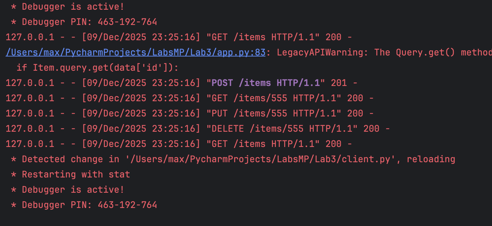
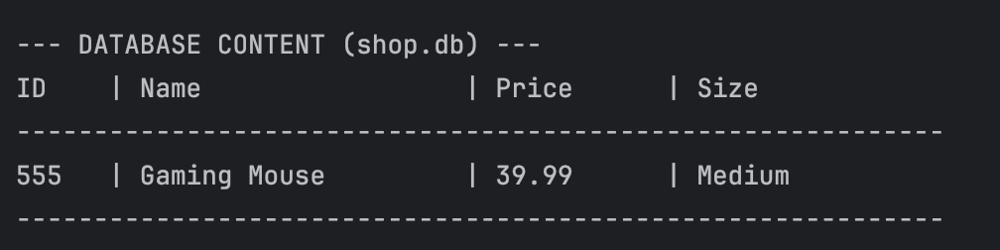
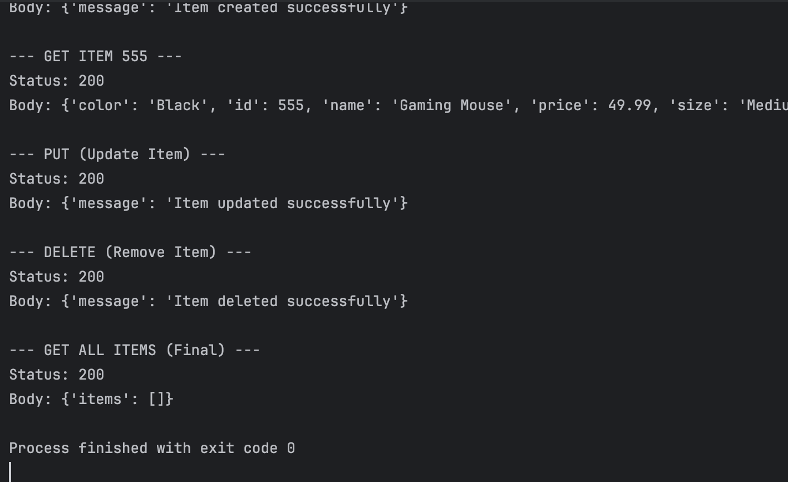

# Лабораторна робота №3: Проектування REST API

## Мета роботи
Ознайомлення з принципами побудови RESTful веб-сервісів, розробка серверної частини на Flask, реалізація HTTP Basic аутентифікації, організація збереження даних у реляційну базу даних SQLite (рівень Hard) та створення клієнтського застосунку для тестування API.

## Хід роботи

### Завдання 1. Розробка REST API веб-сервісу
Створено веб-сервіс `app.py` на базі фреймворку Flask. Реалізовано обробку HTTP-запитів (GET, POST, PUT, DELETE) для керування каталогом товарів. Сервер запущено на порту 5001.

  

<b>Рисунок 1 - Запуск веб-сервісу</b>

---

### Завдання 2. Організація збереження даних (SQLite)
Для реалізації завдання рівня **Hard** підключено базу даних SQLite через ORM SQLAlchemy. Створено моделі `User` (для адміністрування) та `Item` (для товарів з параметрами: ціна, розмір, колір, вага). Файл бази даних `shop.db` створюється автоматично у папці `instance`.

  

<b>Рисунок 2 - Вміст бази даних SQLite</b>

---

### Завдання 3. Реалізація автентифікації та клієнта
Реалізовано захист методів модифікації даних (POST, PUT, DELETE) за допомогою HTTP Basic Auth. Розроблено скрипт `client.py`, який автоматично авторизується та тестує повний цикл роботи API: створення, отримання, оновлення та видалення товарів.

  

<b>Рисунок 3 - Результат роботи клієнта</b>

---

## Висновки
Під час виконання лабораторної роботи ми ознайомилися з проектуванням REST API та роботою з фреймворком Flask. Навчилися використовувати ORM SQLAlchemy для взаємодії з базою даних SQLite, реалізували механізм Basic аутентифікації та закріпили навички автоматизованого тестування веб-сервісів за допомогою клієнтських скриптів на Python.