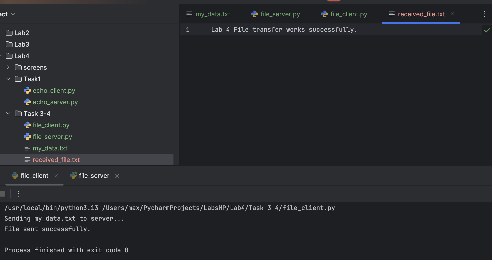

# Лабораторна робота №4: Використання Socket API для мережевих додатків

## Мета роботи
Ознайомлення з принципами роботи сокетів (Socket API) у Python, створення клієнт-серверних додатків для обміну текстовими повідомленнями та передачі файлів через протокол TCP.

## Хід роботи

### Завдання 1. Реалізація Echo-сервера та клієнта
У папці `Task 1-2` розроблено скрипти `echo_server.py` та `echo_client.py`.
Сервер працює у безкінечному циклі, приймає з'єднання та повертає отримані дані клієнту. Це демонструє роботу з TCP-сокетами та обробку запитів.

  

<b>Рисунок 1 - Робота Echo-сервера та клієнта</b>

---

### Завдання 2. Реалізація передачі файлів (TCP)
У папці `Task 3-4` реалізовано механізм передачі файлів.
Скрипт `file_client.py` зчитує файл `my_data.txt` та відправляє його на сервер. Скрипт `file_server.py` приймає потік даних та зберігає його у файл `received_file.txt`. Це виконує вимоги рівня Hard.

  

<b>Рисунок 2 - Успішна передача файлу</b>

---

## Висновки
Під час виконання лабораторної роботи ми ознайомилися з бібліотекою `socket`. Навчилися створювати TCP-з'єднання, прив'язувати сокети до портів та організовувати обмін даними. Реалізовано два типи взаємодії: обмін текстовими повідомленнями (Echo) та передача бінарних даних (файлів).